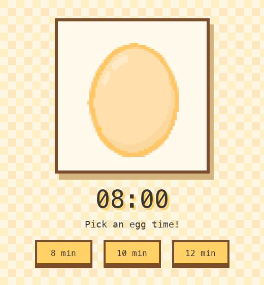

# Always Perfect Eggs

A pixel-art egg timer that can be installed on a phone as a Progressive Web App.

The timer shows a cracking egg as time passes, then reveals the chick when the egg is ready.

## Demo



## Features

- 8, 10, and 12 minute egg timers
- Pixel-art egg stages scaled from 64x64 to 256x256
- Retro pastel interface
- Ding sound when the timer finishes
- Installable PWA metadata
- Offline asset cache through a service worker

## Egg Stages

The image changes based on how much of the timer has elapsed:

```text
0%-25% elapsed     egg-1.png
25%-50% elapsed    egg-2.png
50%-75% elapsed    egg-3.png
75%-100% elapsed   egg-4.png
Done               egg-5.png
```

## Run Locally

Start a local static server:

```bash
python3 -m http.server 8001
```

Then open:

```text
http://localhost:8001/index.html
```

## Add To Phone

For the best phone install experience, host the app at an HTTPS URL first.

On iPhone:

1. Open the HTTPS app URL in Safari.
2. Tap Share.
3. Tap Add to Home Screen.
4. Tap Add.

On Android:

1. Open the HTTPS app URL in Chrome.
2. Tap the menu button.
3. Tap Install app or Add to Home screen.

## Project Files

```text
index.html             App markup, styles, and timer logic
manifest.webmanifest   PWA install metadata
sw.js                  Offline cache service worker
egg-1.png              Whole egg
egg-2.png              Small crack
egg-3.png              Medium cracks
egg-4.png              Large cracks
egg-5.png              Chick final state
icon-180.png           iPhone home-screen icon
icon-192.png           PWA icon
icon-512.png           Large PWA icon
```

## Updating The App

If you change cached files, bump the cache name in `sw.js` so installed copies of the app pick up the new version.

Example:

```js
const CACHE_NAME = "always-perfect-eggs-v7";
```
